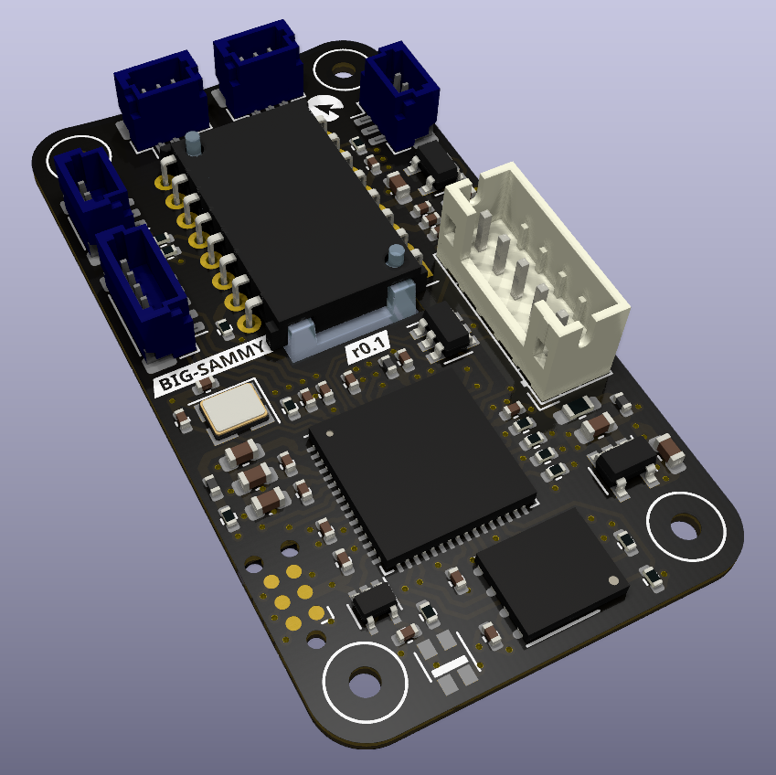

# big-sammy

Open source wired mouse hardware.

## Specifications
- 8 kHz sampling rate support
- Zero latency switch debounce
- Onboard configuration memory
- 2 main mouse buttons (satellite* configuration for both)
- 2 side buttons (symmetric to allow easy left/right handedness)
- encoder + wheel button (satellite* configuration)
- RGB Led

`*meaning, a separate board from the core with the controller and sensor`

## Hardware

- ATSAMS70 MCU (ATSAMS70JxxB-M)
- Optical sensor [PMW3330, PMW3360, PMW3389, Truemove3]
- onboard conectors:
    - JST PH (2mm pitch) for USB
    - JST SH (1mm pitch) for stellite boards
- M2 mounting hardware

|USB pinout||
|-----|-----|
|1|VCC|
|2|DM|
|3|DP|
|4|GND|
|5|Shield|

Peripheral boards are used for the buttons and encoder, available at [generic-mouse-boards](https://github.com/openinput-fw/generic-mouse-boards).

## Firmware

big-sammy is meant to run on [openinput](https://github.com/openinput-fw/openinput).

## License

This hardware is licensed under the [CERN-OHL-P v2](LICENSE) license.
